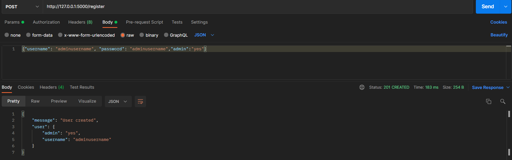

# Banking API

A simple banking API which can:

    - register users and admin
    - allow users to login
    - allow users to apply for loan using JWT
    - allow admin to approve loan using JWT
    - automatically adds payment schedule with weekly frequency
    - allow user to repay the loan
    - mark the loan as PAID once all the repayments are PAID

### Requirements

You will need Python and virtualenv module installed. Remaning will be installed via requriements.txt.

### Install

Clone the repo, create a virtualenv and install the requirements:

```
git clone https://github.com/AmitBanikOfficial/banking-api.git
cd banking-api/aspire_mini_api_lite
virtualenv miniaspireenv
for Windows:
miniaspireenv\Scripts\activate
for linux:
source miniaspireenv/bin/activate
pip install -r requirements
```

### Run 

```
for Windows:
python app.py
for linux:
python3 app.py
```

### Routes

```
http://127.0.0.1:5000/register
http://127.0.0.1:5000/login
http://127.0.0.1:5000/apply_loan
http://127.0.0.1:5000/approve_loan
http://127.0.0.1:5000/view_my_loan
http://127.0.0.1:5000/repay_loan
```

### API

#### Register User

```
http://127.0.0.1:5000/register
```
Method  - POST

Accepts - username(str), password(str), admin(str) - in form of JSON

Returns - JSON

Username length validation:


Username type validation:


Password length validation:


Password type validation:


Username already taken validation:


Admin value validation:


Registering a normal user with missing details:


Registering a normal user with proper details:


Registering an admin user with proper details:



After successfull registration, User table looks like:


#### Login User

```
http://127.0.0.1:5000/login
```

Method  - POST 

Accepts - username(str), password(str) in form of JSON

Returns - JSON, if successfull then with Access Token

If the user does not exist in the database:


If user provides incorrect password:


Successfull user login:


Successfull admin login:


#### Apply Loan

```
http://127.0.0.1:5000/apply_loan
```

Method  - POST 

Accepts - loan_amount(float), term(int) in form of JSON, requires access token as Authorization

Returns - JSON

Admin cannot apply for loan:


User successfully applies for a loan:


Loan data after successfull application and before admin approval:


#### Approve Loan

```
http://127.0.0.1:5000/approve_loan
```

Method  - PUT 

Accepts - loan_id(int) in form of JSON, requires access token as Authorization

Returns - JSON


Only admin can approve loan request:


Admin approves the loan request:


Loan data after admin approval:


Loan repay data after admin approval, this app will automatically add repayment schedule weekly basis based of the term:


#### View My Loan

```
http://127.0.0.1:5000/view_my_loan
```

Method  - GET 

Accepts - requires access token as Authorization

Returns - JSON

Returns loan and loan repayment details for user:


#### Repay Loan

```
http://127.0.0.1:5000/repay_loan
```

Method  - PUT 

Accepts - loanrepay_id and repay_amount in form of JSON, requires access token as Authorization

Returns - JSON

Admin cannot repay loan:


User paid scheduled payment:


Loan repay table data after scheduled payment:


Loan repay table data after user paid all scheduled payments:


Loan table data after after user paid all scheduled payments, the loan is PAID automatically:


## Run Unittest

```
cd banking-api/aspire_mini_api_lite
python test_app.py
```


